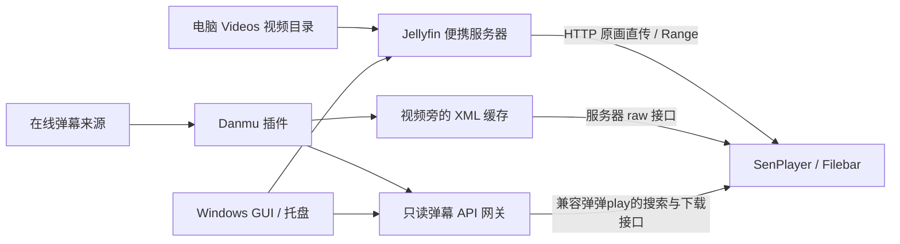

# 实现结构

## 数据流

视频使用 Jellyfin 的 HTTP 服务，支持按字节读取，GUI 不转发视频数据。网关独立监听弹幕端口，转发指定的弹幕 GET 路由，管理接口不在转发范围内。

## Windows 控制台

使用 C#、.NET Framework 4.8、WinForms；异步 HTTP 和后台进程管理使界面保持响应。使用 Windows 自带 csc 构建，在这台未安装 SDK 的电脑上直接生成 x64 GUI 程序。

状态区区分服务进程存在和接口真正就绪。启动时等待 Jellyfin 健康检查；首次用户创建通过 Jellyfin 12 的 Startup/User GET 初始化，再设置账号。登录后使用带 Token 的标准 MediaBrowser Authorization 请求头。

所有运行数据放在项目 data 下。影片通过 Jellyfin 媒体库 API 搜索，手动弹幕匹配使用插件的作品搜索、分集读取与 XML 下载接口。

## 服务所有权与关闭

进程记录包含 PID、启动时间和可执行文件路径。重新打开控制台时，仅接管与记录完全一致的本项目 Jellyfin 实例。端口冲突明确报错，不关闭其他占用者。

停止时先关闭弹幕网关，再请求 Jellyfin 有序退出；超时后仅终止已确认所有权的进程及其子进程。退出不会禁用开机启动，下次登录仍按设置启动。

右上角关闭按钮遵循用户设置，托盘菜单明确区分停止服务和退出。重复启动通过命名 Mutex 与 Event 恢复原窗口。开机启动项仅写入当前用户的 Run 项，命令包含 --tray --start，不要求安装 Windows Service。

## 设置与凭证

settings.json 使用原子替换并保留 .bak；损坏配置报错，不自动覆盖。管理员访问凭证和随机弹幕密钥使用当前用户的 DPAPI 加密，移动到另一 Windows 账号时需要重新登录。密码不写入设置或日志。

默认关闭开机启动和手动打开时自动启动服务，默认关闭窗口到托盘。视频转码策略应用到当前连接账号，其他播放账号单独配置。

## 验证边界

自检覆盖配置持久化、凭证、路由隔离和命令参数。集成测试使用真正的 Jellyfin 12.1 和 Danmu 2.8.0.0、合成 MP4、测试 XML，验证账号、原画策略、插件、搜索、视频 Range、弹幕 raw/网关和服务生命周期。

iPad 无法由本机自动操控，两款实际客户端的自动弹幕加载、真实蓝光播放码率和路由器吞吐量应在用户设备上验证。自动匹配的内容覆盖和在线弹幕源可用性由上游插件决定。
